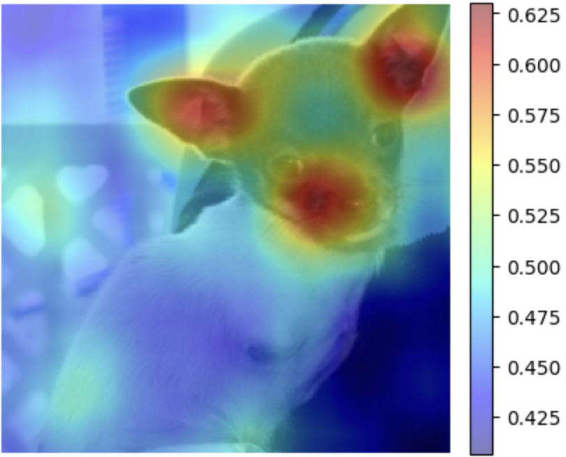
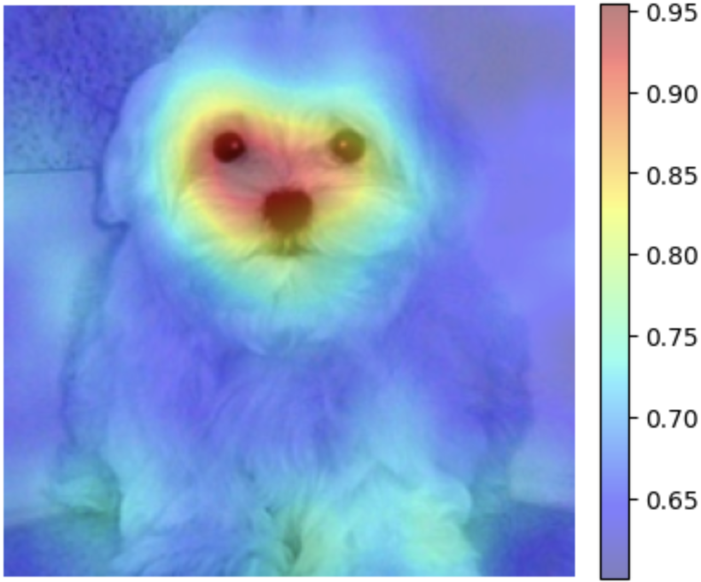
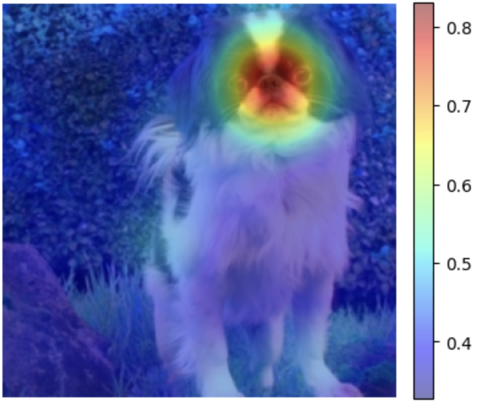

# Explainable Image Classifier: case study on Dogs Breeds
This repository contains the source code necessary to reproduce all the results of the work.

## Project Abstract
 Explainability helps the AI agent through several stages of its life. For instance, when the agent is weak, it can help direct scientists to the weaknesses. The second case is when the agent has the same strength as a specialized person; it increases others' confidence and trust. The last scenario is when the agent is hugely more potent; we could learn from it. In this work, we address the issue of explainability of image classifiers. A dataset of three different types of dogs is used. We used two approaches; one relied on dealing with our models as a complete black box, and the other benefited from the gradient signal to understand what was happening inside the model. 
  
In this work, we are interested to know which parts of the image our model used to make correct predictions about the different classes in the dataset. The images below express our findings with one classifier. We can see how our classifier focuses on specific parts of the dog for each breed to make a correct prediction.

  
  
  

## Repository contents
* The whole idea is implemented in [project_NoteBook](Notebook/project_NoteBook.ipynb) notebook. It is done in PyTorch. 
* [Report](report.pdf) contains the full report.
* [Supplementary matierals](supplementary_materials_links.txt) contains links to the remaining results and the dataset.
* [RISE_Implementation](Notebook/rise.py) contains the implementation of the RISE technique from scratch.
* [Dog_file](Notebook/dogs_classes_ImageNet.csv) contains the name of dog classes from ImageNet.